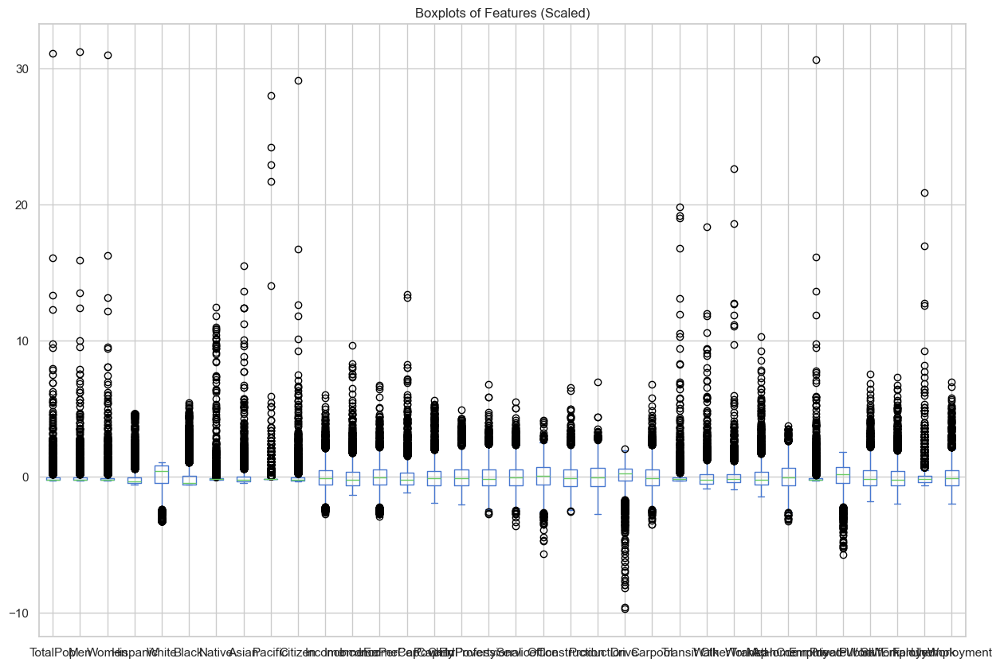
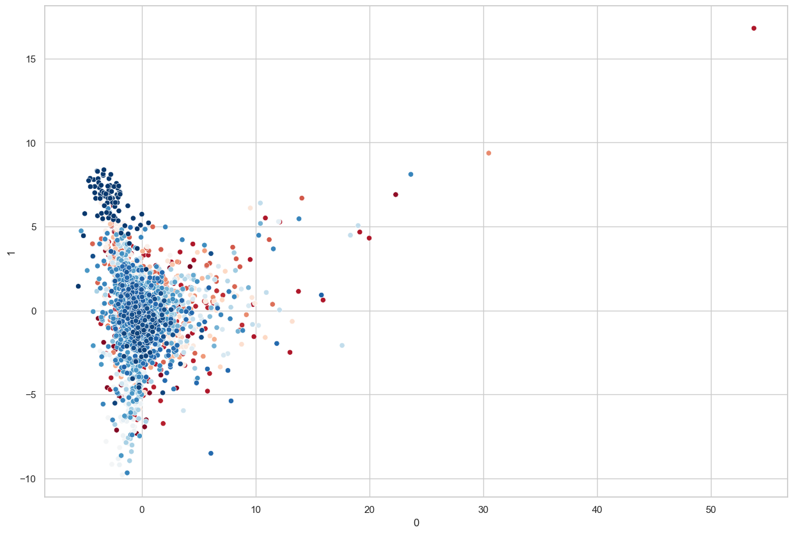
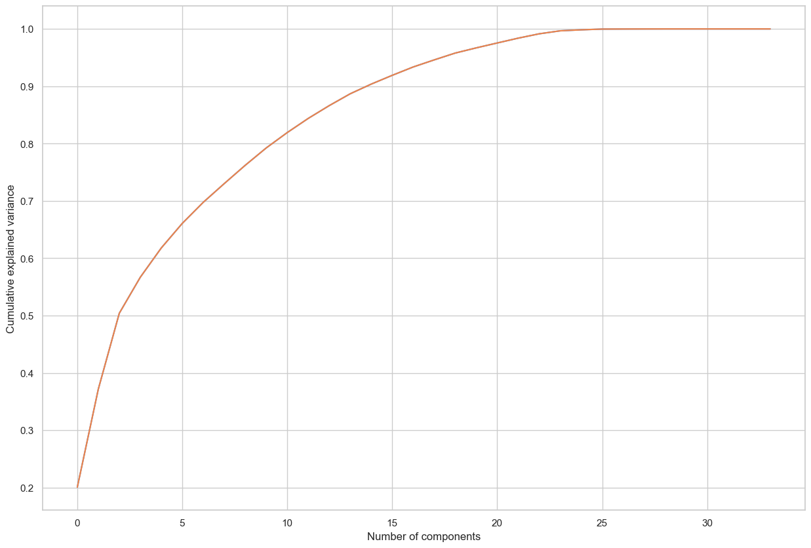

# **Prediction Analysis on 2015 US Census Dataset | PCA Dimensionality Reduction**  

## **INTRODUCTION**  
The **2015 US Census Dataset** contains various demographic, economic, and social attributes. This project explores the dataset using **Principal Component Analysis (PCA)** for **dimensionality reduction** and prediction analysis. PCA is an essential technique in **Machine Learning** and **Data Science** to reduce the complexity of datasets while preserving essential information.  

## **PROBLEM STATEMENT**  
With large and complex datasets, **reducing dimensionality** while retaining key insights is crucial for efficient model performance. This project aims to:  
- **Identify key features that capture most of the variance in the dataset.**  
- **Apply PCA for dimensionality reduction and visualization.**  
- **Evaluate the impact of PCA on predictive model performance.**  

## **SKILL DEMONSTRATION**  
- **Exploratory Data Analysis (EDA)**  
- **Data Preprocessing & Feature Engineering**  
- **Principal Component Analysis (PCA)**  
- **Visualization of PCA Components**  
- **Model Training & Performance Evaluation**  

## **DATA SOURCING**  
- The dataset is derived from the **2015 US Census Bureau**, containing features related to **income, employment, education, and demographics.**  
- The dataset includes both **numerical and categorical variables**, requiring preprocessing before applying PCA.  

## **DATA PREPROCESSING**  
- **Handling Missing Values**  
- **Standardization (Scaling the data for PCA analysis)**  
- **Encoding Categorical Variables**  
- **Feature Selection for PCA Application**  

## **EXPLORATORY DATA ANALYSIS (EDA)**  
- **Statistical Summary of Features**  
- **Distribution of Key Variables**  
- **Correlation Heatmap to Identify Highly Correlated Features**  

## **PRINCIPAL COMPONENT ANALYSIS (PCA)**  
- **Determining the Optimal Number of Principal Components** (Explained Variance Ratio)  
- **Visualizing PCA Components** using a **2D and 3D plot**  
- **Interpreting the Contribution of Each Principal Component**  

## **MODEL TRAINING & EVALUATION**  
- **Applying PCA-Transformed Features to a Prediction Model**  
- **Training a Machine Learning Model (e.g., Logistic Regression, Decision Tree)**  
- **Performance Evaluation Metrics (Accuracy, Precision, Recall, F1-score)**  

## **CONCLUSION**  
- **PCA effectively reduces the dataset’s dimensionality while retaining key patterns.**  
- **The first few principal components explain a significant portion of the variance.**  
- **Dimensionality reduction can improve model training speed and performance.**  
